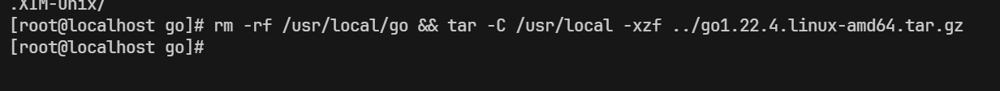
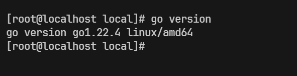
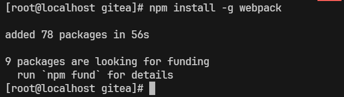

## 前言

## 二进制安装

### 下载二进制包

从[下载地址](https://dl.gitea.com/gitea/)下载最新的二进制包

```shell
wget https://dl.gitea.com/gitea/1.22.0/gitea-1.22.0-linux-amd64

# 赋予执行权限
chmod +x gitea-1.22.0-linux-amd64 
```

### 验证 GPG 签名

Gitea 对打包的二进制文件使用 GPG密钥 签名以防止篡改。 请根据对应文件名 .asc 中包含的校验码检验文件的一致性。

```shell
# 下载签名文件
wget https://dl.gitea.com/gitea/1.22.0/gitea-1.22.0-linux-amd64.asc
```


```shell
gpg --keyserver keys.openpgp.org --recv 7C9E68152594688862D62AF62D9AE806EC1592E2
gpg --verify gitea-1.22.0-linux-amd64.asc gitea-1.22.0-linux-amd64
```

> ~~**注**：[文档](https://docs.gitea.com/zh-cn/installation/install-from-binary)写的很完整了，不写了。~~

### 基本的设置

将下载到的 gitea 可执行文件存放到指定位置，这里存放到 `/opt/gitea/bin`

创建文件夹
```shell
mkdir -p /opt/gitea/bin
```

复制文件
```shell
cp -ur gitea1.22.0-linux-amd64 /opt/gitea/bin
```

创建软链接
```shell
ln /opt/gitea/bin/gitea1.22.0-linux-amd64 /usr/bin/gitea
```

### 添加新的系统用户

> 从 gitea 文档抄袭
```shell
# On Ubuntu/Debian:
adduser \
   --system \
   --shell /bin/bash \
   --gecos 'Git Version Control' \
   --group \
   --disabled-password \
   --home /home/git \
   git

# On Fedora/RHEL/CentOS/OpenEuler:
groupadd --system git
adduser \
   --system \
   --shell /bin/bash \
   --comment 'Git Version Control' \
   --gid git \
   --home-dir /home/git \
   --create-home \
   git
```

### 创建工作路径

```bash
mkdir -p /var/lib/gitea/{custom,data,log}
chown -R git:git /var/lib/gitea/
chmod -R 750 /var/lib/gitea/
mkdir /etc/gitea
chown root:git /etc/gitea
chmod 770 /etc/gitea
```

### 创建服务

创建系统服务文件
```shell
vim /etc/systemd/system/gitea.service
```

写入下列内容：[gitea.service demo](https://github.com/go-gitea/gitea/blob/release/v1.22/contrib/systemd/gitea.service)

**注：** 因为使用 sqlite3 作为数据库，因此不需要将 service 做太大的更改

```service
After=network.target

[Service]
RestartSec=2s
Type=simple
User=git
Group=git
WorkingDirectory=/var/lib/gitea/
# 注意自己的路径
ExecStart=/usr/bin/gitea web --config /etc/gitea/app.ini
Restart=always
Environment=USER=git HOME=/home/git GITEA_WORK_DIR=/var/lib/gitea

[Install]
WantedBy=multi-user.target
```

### 启动 gitea

```shell
systemctl daemon-reload
systemctl enable gitea --now
```

## 编译安装

> **注：**因为分配的虚拟机内存太小（2G）编译webpack的时候内存溢出，这篇鸽一会儿。

### 所需要的软件包

1. Go
2. Nodejs
3. npm

### Go

> 参考官方文档： [Go Wiki](https://go.dev/doc/install)

1. 下载 go 软件包

> 从[这里](https://go.dev/dl/)找到最新的 go 安装包

```shell
# 下载
wget https://go.dev/dl/go1.22.4.linux-amd64.tar.gz
```

2. 删除之前安装的 go 并且安装

```shell
# 注意替换 tar.gz 的名称
rm -rf /usr/local/go && tar -C /usr/local -xzf go1.22.4.linux-amd64.tar.gz
```
权限不足则使用 root 用户来执行。



3. 配置环境变量

配置在 `/etc/profile` 中，以便所有用户都能使用 **go**

打开 `/etc/profile`

```shell
vim /etc/profile
```

在最后一行加上

```shell
export PATH=$PATH:/usr/local/go/bin
```

`:wq` 保存退出

```shell
# 让环境变量生效
source /etc/profile
```

查看安装结果

```shell
go version
```



### Nodejs 和 npm

这里以 `openEuler 2203` 为例

```shell
# 安装 nodejs 和 npm
yum install -y nodejs npm
```

升级 nodejs，这里使用 `n` 来管理 nodejs

```shell
# 安装 n 管理器
npm install -g n

# 升级 nodejs 到最新稳定版，如果失败，加上 sudo
n stable
```

执行 `n stable` 的同时已经更新了 **npm**，重新连接服务器或者输入 `bash` 命令让新的软件包生效。

## 编译 gitea

> 参考： [Gitea 文档](https://docs.gitea.com/zh-cn/installation/install-from-source)

### 下载 gitea 源码

```shell
git clone https://github.com/go-gitea/gitea
```

### 编译

构建成单一整体的二进制文件，并且启用 **sqlite**

```shell
TAGS="bindata sqlite sqlite_unlock_notify" make build
```
如果遇到如下错误：


安装 webpack

```shell
npm install -g webpack
```




## 更新记录

1. **2024-06-19** 

## 参考文档

1. [Gitea 文档](https://docs.gitea.com/zh-cn/installation/install-from-source)
2. [Go Wiki](https://go.dev/doc/install)
3. [gitea.service - github](https://github.com/go-gitea/gitea/blob/release/v1.22/contrib/systemd/gitea.service)