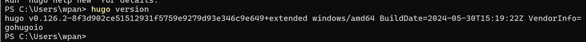
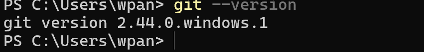
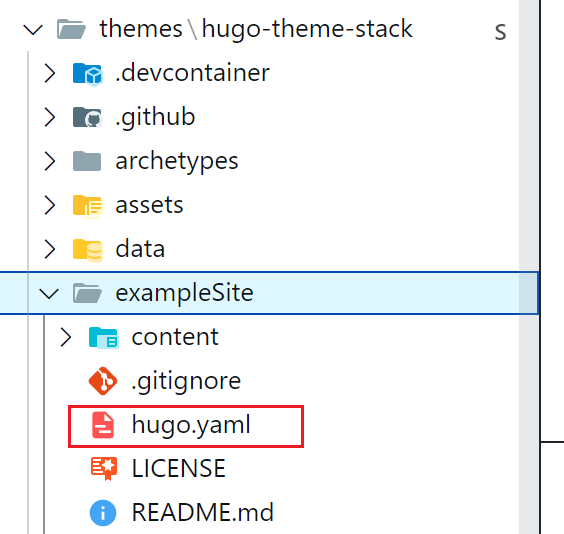

# 前提条件

1. 安装 **Hugo** （拓展版）
2. 安装 **Git**

# 软件安装

## 1. Hugo

**`windows`** 平台

可以使用系统自带的包管理器进行安装，例如 `winget`

下面是一个例子：

```shell
# 搜索 Hugo 包
winget search hugo

# 安装 Hugo
winget install Hugo.Hugo

# 安装 Hugo 拓展
winget install Hugo.Hugo.Extended
```

**`Linux`** 平台

-- TODO

## 2. Git

**`windows`** 平台

同样可以使用 `winget` 进行安装

```shell
# 可以搜索 Git
winget search git

# 安装 Git
winget install Git.Git
```

**`Linux`** 平台

-- TODO

## 验证安装

打开命令行，验证 `Hugo` 以及 `Git`

```shell
# 验证 Hugo
hugo version

# 验证 Git
git --version
```

如图：





# 快速开始

## 创建网站

### 1. 创建新的项目（网站）

```shell
hugo new site 项目名称

# eg:
hugo new site my_blogs
```

### 2. 进入项目的根目录

```shell
cd 项目名称

# eg:
cd my_blogs
```

### 3. 创建 Git 仓库

```shell
git init
```

### 4. 选择一个好看的主题

> 在这个网址进行选择：
> [Hugo 主题](https://themes.gohugo.io/)

这里我选择的主题是： [Stack](https://themes.gohugo.io/themes/hugo-theme-stack/#documentation)

> Tips: Stack 主题的文档比较完善，可以从这里进入查看：[Stack Documents](https://stack.jimmycai.com/guide/getting-started)

在项目根目录下执行，将主题源码仓库添加到博客当中

```shell
git submodule add https://github.com/CaiJimmy/hugo-theme-stack/ themes/hugo-theme-stack
```

### 5. 使主题生效

> Tips: 下载的主题需要查看他们的文档（如果有的话），部分主题的设置会有不同

打开 `themes/hugo-theme-stack` ，如图：



将 `hugo.yaml` 复制到项目根目录，并且删除 `hugo.toml`， 此时就会默认加载 **yaml** 配置文件而不是 **toml** 配置文件。


### 6. 查看网站

检查主题是否生效

```shell
hugo server
```

用浏览器打开网站查看（一般是 http://localhost:1313）

# 说明

此后文章按照 `Stack` 主题进行记录

# 参考文档

1. [Hugo 快速开始](https://hugo.opendocs.io/getting-started/quick-start/)
2. [Hugo 主题](https://themes.gohugo.io/)
3. [Stack 主题](https://themes.gohugo.io/themes/hugo-theme-stack/#documentation)
4. [Stack 主题文档](https://stack.jimmycai.com/guide/getting-started)