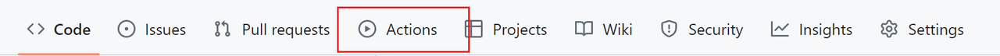
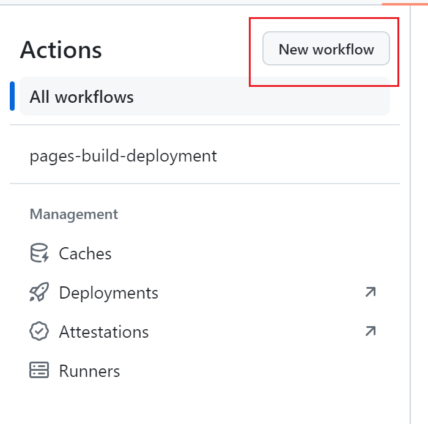
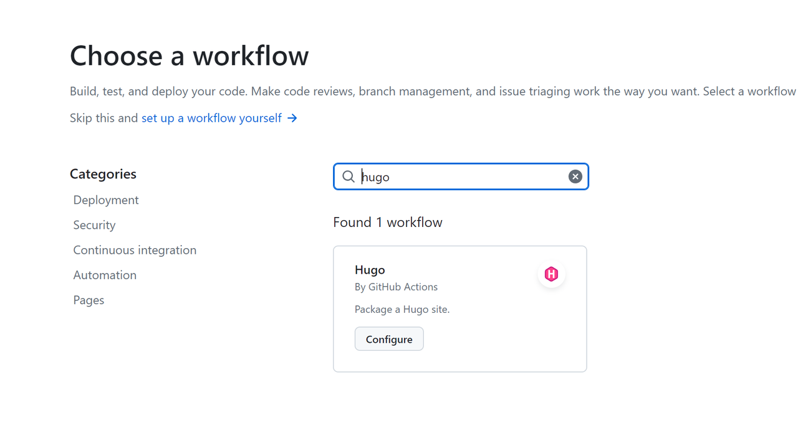
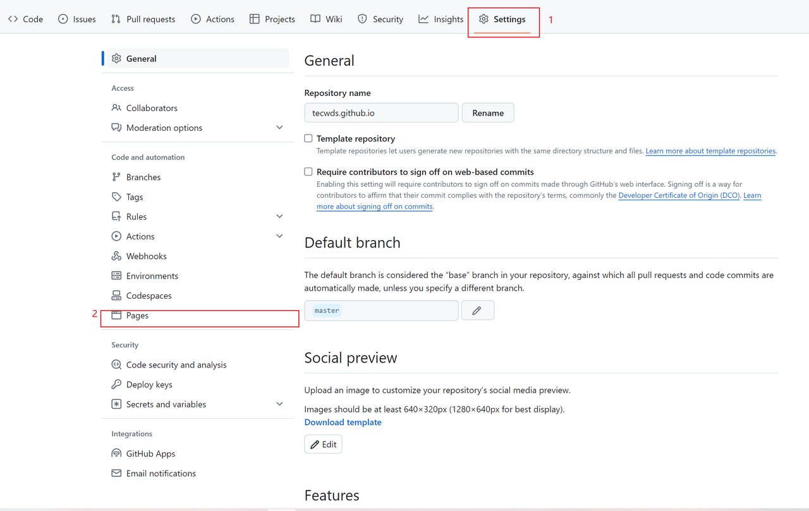
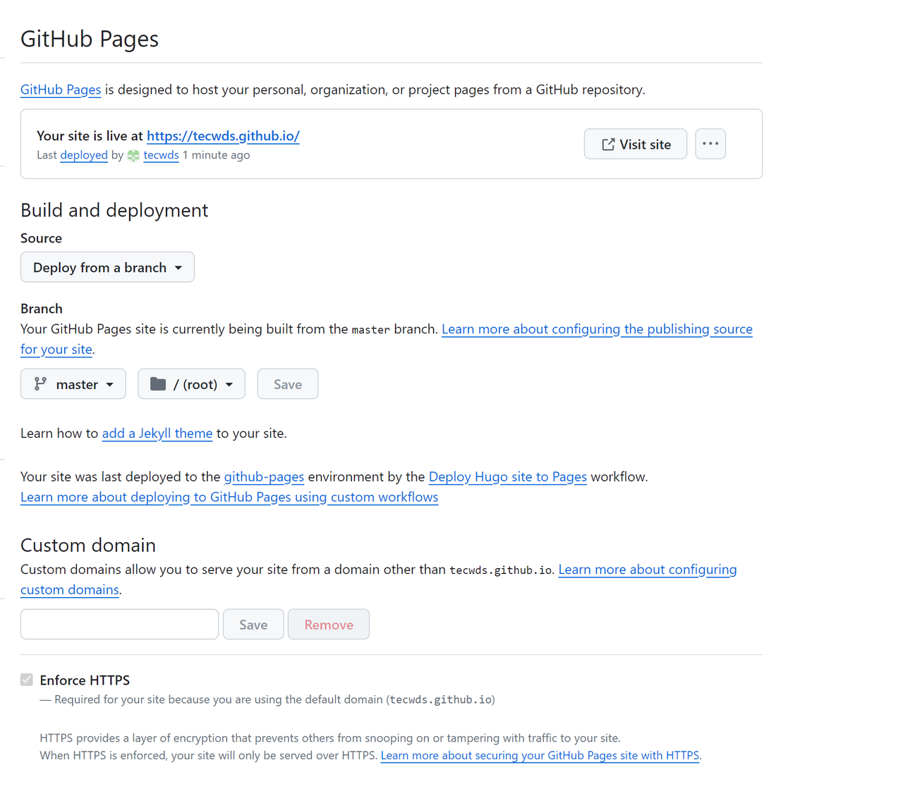

## 基本使用

### 查看版本

```shell
hugo version
```

### 帮助文档

`hugo` 的可用命令和帮助文档

```shell
hugo help
```

`hugo` 子命令帮助

```shell
hugo [cmd] --help

# eg:
hugo server --help
```

### 构建站点

进入项目目录：

```shell
hugo

# 上述命令会将站点发布到 public 目录，会覆盖以前的文件
```

发布站点至指定目录：

```shell
hugo -d custom_public/
```

### 发布指定文章

发布草稿：

```shell
hugo --buildDrafts

# or 
hugo -d
```

发布其他：

```shell
# 1.
hugo --buildExpired
# or 
hugo -E

# 2.
hugo --buildFuture
# or
hugo -F
```

### 发布（测试）站点

```shell
hugo server
```

上述命令会构建站点，可以通过 `http://localhost:1313` 查看访问。

> 实时重载:
> 使用 hugo server 之后，站点对 md 文档的实时改动都可以检测到，也就是实时更新。
> 不过需要注意的是，在编辑器当中，例如 vscode 设置了文件改动立即保存，此时对文章的改动会触发多次重载，会导致构建失败而出现无法实时预览，此时只需要重启命令（重新运行 hugo server)。

> Tip: 自动重定向
> 启动的时候，可以使用 --navigateToChanged 来跟踪实时改动的文档，浏览器会自动重定向到最后修改的页面。
> ```shell
> hugo server --navigateToChanged
> ```

## 配置 Github pages

### 创建空的仓库

首先浏览器进入 Github，网址为：https://github.com

接下来按照下列步骤创建仓库：

创建一个仓库，仓库名字需要为：[你的用户名].github.io 

> eg： **admin.github.io**

仓库需要设置为**公开**。其他默认，点击创建

### 初始化本地仓库

在本地项目仓库，执行下列命令：

```shell
# 1. 提交改动文件
git add .
git commit -m "first commit"

# 2. 添加远程仓库
git remote add origin [you git repo url]
# eg
git remote add origin https://github.com/tecwds/tecwds.github.io.git

# 3. 推送
git push -u origin master
```

> Tips：
>
> 如果 https 形式的推送失败，可以试一试 ssh 形式，前提是你的 ssh 公钥在 github 成功配置

### 配置 github actions



点击 **actions** 并创建新的 **workflow**



然后搜索 **hugo**



使用这个模板，后点击提交（模板内容一般不需要改变）。

### 设置 github pages





参照这个进行修改。

注意： **custom domain** 的内容一般不需要修改，如果没有域名，修改了后续配置会比较麻烦（保持为空即可），这个后面再说。

## 参考文档

1. [Hugo官方文档](https://hugo.opendocs.io/getting-started/usage/)
2. [Github主页](https://github.com)
