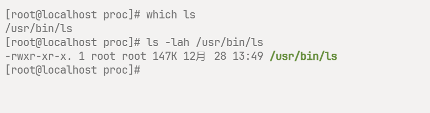

## 概述

TODO 文笔不好，以后做。

## 查询命令

命令的位置信息：

### 基于 **PATH** 变量

#### which 命令

使用 `which` 命令，此命令用于查找文件，不一定局限于命令

`which` 命令会在环境变量 $PATH 中查找符合条件的文件


```shell
which 命令
```


#### `which` 命令参数

| 参数 | 说明 |
| ---- | ---- | 
| -n<文件名长度> | 指定文件名长度，指定的长度必须大于或等于所有文件中最长的文件名 |
| -p<文件名长度> | 与-n参数相同，但此处的<文件名长度>包括了文件的路径 |
| -w | 指定输出时栏位的宽度 |
| -V | 显示版本信息 |

#### 实战

1. 查询 ls 所在的位置

```shell
which ls
```

可以看到输出为：



> Tips: `ssh` 连接工具为 [Tabby](https://github.com/Eugeny/tabby)


## 更新记录

1. **2024-06-18** 一点内容

## 参考文档

1. [菜鸟教程 - which](https://www.runoob.com/linux/linux-comm-which.html)
2. [Github - Tabby](https://github.com/Eugeny/tabby)
